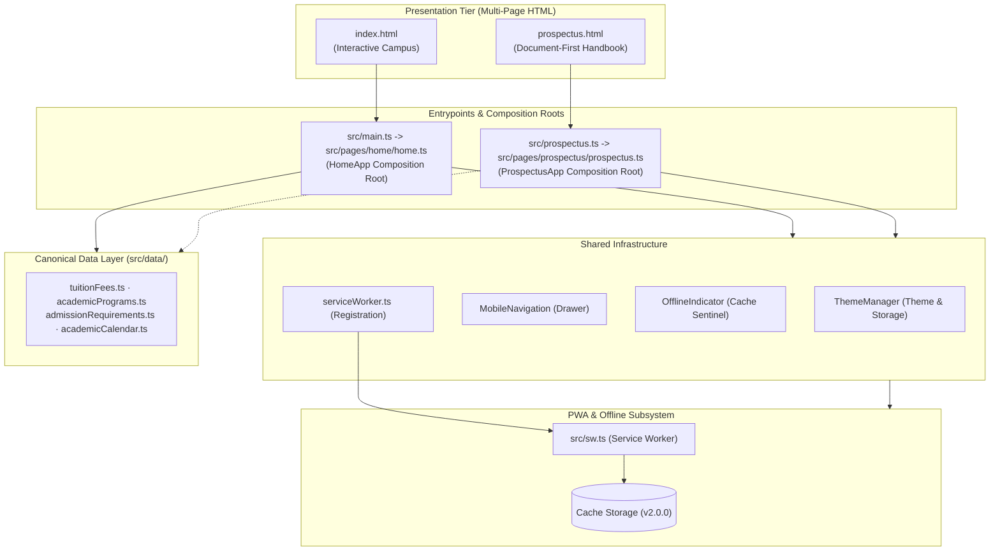

# SJCCC Application Architecture

Welcome to the technical architecture documentation system for **St. Joseph's Catholic Comprehensive College (SJCCC)**, Mbengwi.

This document serves as the **master architecture index and navigation hub**. Detailed technical specifications, dependency matrices, and runtime behaviors are documented in focused modules within [`docs/architecture/`](architecture/) and visual models within [`docs/diagrams/`](diagrams/).

---

## 1. System Overview

SJCCC is engineered as a **dual-entrypoint, progressive web application (PWA)** built with TypeScript, multi-page HTML, and modular CSS:
- **Interactive Digital Campus (`/` or `/index.html`)**: An interactive landing page featuring procedural hero physics, touch-enabled carousels, dynamic circular announcements, an interactive 6-zone virtual campus map, and admissions enquiry handling.
- **Document-First Student Handbook (`/prospectus.html`)**: An official reference student handbook built under a strict **document-first** philosophy. All regulations, uniforms, and approved fee schedules are rendered directly in static semantic HTML, ensuring 100% readability with JavaScript disabled, accompanied by an A4 print engine.

Both pages share unified core services (`ThemeManager`, `MobileNavigation`, `OfflineIndicator`), canonical datasets in `src/data/`, and a two-stage Service Worker caching pipeline.

---

## 2. High-Level Architecture Map

*Mermaid source: [docs/diagrams/application-architecture.mmd](diagrams/application-architecture.mmd)*

---

## 3. Documentation Map

| Specification Document                                                 | Area Covered                                                                                       |
|:-----------------------------------------------------------------------|:---------------------------------------------------------------------------------------------------|
| **[System Overview](architecture/overview.md)**                        | High-level system architecture, dual-entrypoint design, and structural tiers.                      |
| **[Shared Infrastructure](architecture/shared-infrastructure.md)**     | `ThemeManager`, `MobileNavigation`, `OfflineIndicator`, and shared storage/selector primitives.    |
| **[Homepage Architecture](architecture/homepage.md)**                  | `HomeApp` composition root, hero scroll physics, carousel, virtual map, and admissions modal.      |
| **[Prospectus Architecture](architecture/prospectus.md)**              | `ProspectusApp`, zero-JS baseline readability, native print export, and paired card layouts.       |
| **[CSS Architecture](architecture/css-architecture.md)**               | Core design tokens, dark mode overrides, fluid typography, and the 10-module prospectus CSS suite. |
| **[TypeScript Architecture](architecture/typescript-architecture.md)** | Module taxonomy, initialization lifecycle, strict compiler contracts, and feature organization.    |
| **[Canonical Data Layer](architecture/data-layer.md)**                 | Data sources in `src/data/`, dynamic hydration, and static HTML duplication requirements.          |
| **[Navigation Architecture](architecture/navigation.md)**              | Desktop menus, mobile drawer, bottom tab bar, scrollspy, and keyboard navigation.                  |
| **[PWA & Offline Architecture](architecture/pwa.md)**                  | Service worker caching strategies, precache sets, runtime eviction, and offline handbook viewing.  |
| **[Accessibility Architecture](architecture/accessibility.md)**        | Semantic landmarks, `:focus-visible` rings, `.sr-only` utilities, and reduced motion safety.       |
| **[Build & Deployment](architecture/build-and-deployment.md)**         | Vite Rollup multi-page bundling, two-stage Service Worker compilation, and production artifacts.   |
| **[Architectural Decision Records](architecture/decisions.md)**        | Accepted architectural decisions (ADRs 001–006) preserving core technical intent.                  |

---

## 4. Visual Architecture Diagrams (`docs/diagrams/`)

All system diagrams are maintained as standalone Mermaid source files:

1. **[Application Architecture](diagrams/application-architecture.mmd)**: High-level system dependencies and tier boundaries.
2. **[Module Dependencies](diagrams/module-dependencies.mmd)**: Detailed dependency graph from entrypoints down to data stores.
3. **[Shared Infrastructure](diagrams/shared-infrastructure.mmd)**: Shared controllers, browser APIs, and page consumers.
4. **[Homepage Runtime Flow](diagrams/homepage-flow.mmd)**: Sequence diagram of homepage initialization and user events.
5. **[Prospectus Runtime Flow](diagrams/prospectus-flow.mmd)**: Sequence diagram of zero-JS document loading and PDF export.
6. **[Data Flow & Parity](diagrams/data-flow.mmd)**: Runtime dynamic hydration versus static document duplication.
7. **[PWA Lifecycle](diagrams/pwa-flow.mmd)**: Service Worker installation, cache population, and offline routing.
8. **[Service Worker Request Flow](diagrams/service-worker-flow.mmd)**: Classification decision tree for navigation, assets, and CDNs.
9. **[CSS Architecture](diagrams/css-architecture.mmd)**: Token relationships, homepage stylesheets, and 10-module prospectus tree.
10. **[Build & Deployment Pipeline](diagrams/deployment-flow.mmd)**: Multi-page Vite compilation and asset manifest injection.

---

## 5. Core Architectural Principles

1. **Document-First for Statutory Content**: The official prospectus must remain fully readable without JavaScript. Never introduce client-side DOM injection for core institutional text.
2. **Reuse Shared Infrastructure**: Cross-cutting concerns (`ThemeManager`, `MobileNavigation`, `OfflineIndicator`) must be shared rather than duplicated.
3. **Strict Separation of Concerns**: Homepage interactive features belong in `src/features/`; generic primitives belong in `src/ui/`; canonical data belongs in `src/data/`.
4. **Offline First**: All critical application paths must function without an active network connection once cached.

---

## 6. Rules for Future Changes (Guidelines for Developers & AI Agents)

When adding features, modifying code, or performing refactors, developers and AI coding agents must adhere to the following rules:

1. **Never Duplicate Shared Systems**: Do not create page-specific variations such as `prospectusTheme.ts` or `customDrawer.ts`. Parameterize and reuse the existing classes in `src/core/` and `src/ui/`.
2. **Preserve Zero-JS Readability on Prospectus**: Any CSS changes in `src/css/prospectus/` must maintain default `opacity: 1; transform: none; display: block;` for document sections. Do not hide text behind client-side reveal classes.
3. **Do Not Introduce Runtime Rendering for Handbook Copy**: Canonical data in `src/data/` (e.g. `tuitionFees.ts`) exists as a programmatic reference, but static HTML tables in `prospectus.html` must remain static HTML. If automated sync is required, implement build-time templating, never runtime client-side DOM injection.
4. **Preserve Native Print PDF Delegation**: The PDF download button on the prospectus page must invoke `window.print()`. Layout adjustments, page sizing, and chrome suppression belong in `src/css/prospectus/print.css`. Do not add client-side PDF generation libraries.
5. **Respect CSS Ownership Boundaries**:
   - Shared tokens go in `src/css/core/tokens.css`.
   - Homepage feature styles go in `src/css/features/`.
   - Prospectus styles go in the 10 domain modules under `src/css/prospectus/`.
6. **Check All Consumers Before Modifying Shared Code**: `ThemeManager`, `MobileNavigation`, `OfflineIndicator`, and `serviceWorker.ts` are consumed by multiple pages. Always test both `/index.html` and `/prospectus.html` after touching shared code.
7. **Keep Entrypoints Minimal**: `src/main.ts` and `src/prospectus.ts` are bootstrap entrypoints. Logic belongs in page composition roots (`src/pages/`) or feature modules (`src/features/`).
