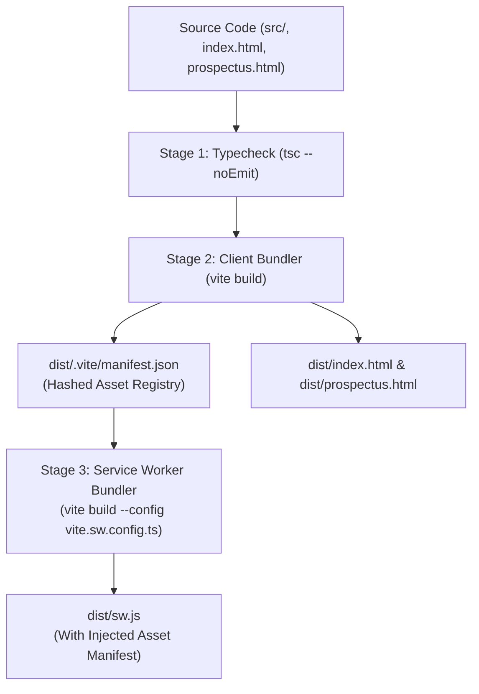

# Build & Deployment Architecture

## 1. Overview

SJCCC uses a modern multi-page build pipeline powered by **Vite** and **TypeScript 5.x**. A distinctive aspect of the architecture is the **two-stage build process**, which allows the Service Worker to dynamically precache hashed production assets generated by Vite.



*Mermaid source: [docs/diagrams/deployment-flow.mmd](../diagrams/deployment-flow.mmd)*

---

## 2. Build Pipeline Stages (`package.json`)

The production build script is defined in `package.json`:
```json
"scripts": {
    "dev": "vite",
    "build": "tsc && vite build && vite build --config vite.sw.config.ts",
    "preview": "vite preview",
    "lint": "tsc --noEmit"
}
```

### Stage 1: Static Typecheck (`tsc`)
- Runs `tsc --noEmit` based on `tsconfig.json`.
- Validates strict types across all 60+ TypeScript modules.
- Halts compilation immediately if any type, import, or syntax error exists.

### Stage 2: Multi-Page Client Bundling (`vite build`)
- Configured via `vite.config.ts`:
  ```typescript
  export default defineConfig({
      build: {
          rollupOptions: {
              input: {
                  main: resolve(__dirname, 'index.html'),
                  prospectus: resolve(__dirname, 'prospectus.html'),
              },
          },
          manifest: true,
      },
  });
  ```
- **Inputs**: `index.html` and `prospectus.html`.
- **Outputs**:
  - `dist/index.html` and `dist/prospectus.html`.
  - Hashed JS bundles: `dist/assets/main-[hash].js`, `dist/assets/prospectus-[hash].js`.
  - Hashed CSS chunks: `dist/assets/main-[hash].css`, `dist/assets/prospectus-[hash].css`.
  - **Asset Manifest**: Generates `dist/.vite/manifest.json`, mapping original source paths to their production hashed filenames.

### Stage 3: Service Worker Compilation (`vite.sw.config.ts`)
- Configured via `vite.sw.config.ts`.
- Compiles `src/sw.ts` into a self-contained Service Worker output at `dist/sw.js`.
- Reads `dist/.vite/manifest.json`, extracts all hashed CSS and JS filenames, and injects them as an array constant into `__SW_MANIFEST_ASSETS__`.
- This ensures the Service Worker precaches the exact hashed files without requiring manual maintenance of bundle hashes.

---

## 3. Production Artifacts Directory (`dist/`)

```text
dist/
├── index.html                    # Production Homepage HTML
├── prospectus.html               # Production Prospectus HTML
├── sw.js                         # Compiled Service Worker
├── manifest.json                 # Web App Manifest
├── .vite/
│   └── manifest.json             # Vite Rollup Asset Manifest
└── assets/
    ├── main-DtFRR8oB.js          # Homepage JS chunk (65 kB gzip)
    ├── prospectus-DrXmSQYP.js    # Prospectus JS chunk (0.5 kB gzip)
    ├── OfflineIndicator-*.js     # Shared offline module chunk
    ├── main-TYDenAyr.css         # Homepage CSS bundle (70 kB gzip)
    ├── prospectus-BZOLanDn.css   # Prospectus CSS bundle (9.7 kB gzip)
    └── [photography and icons]
```

---

## 4. Hosting & Deployment Environment

- **Production Target**: Vercel / Google Cloud Run containerized edge.
- **Protocol**: HTTPS (enforced for Service Worker security).
- **Caching Headers**:
  - `dist/index.html`, `dist/prospectus.html`: `Cache-Control: no-cache` (allows instant Service Worker update checks).
  - `dist/assets/*`: `Cache-Control: public, max-age=31536000, immutable` (hashed assets are cached permanently).
  - `dist/sw.js`: `Cache-Control: no-cache` (browser checks for worker updates on navigation).

---

## 5. Cross-Links

- [System Overview](overview.md)
- [PWA & Offline Architecture](pwa.md)
- [TypeScript Architecture](typescript-architecture.md)
- [CSS Architecture](css-architecture.md)
