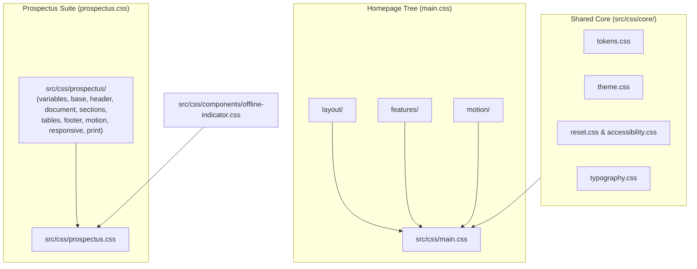

# CSS Architecture & Design System

## 1. Overview

The SJCCC stylesheet architecture separates shared design tokens, homepage interactive styling, and an isolated 10-module stylesheet suite dedicated to the official Prospectus.



*Mermaid source: [docs/diagrams/css-architecture.mmd](../diagrams/css-architecture.mmd)*

---

## 2. Core Tokens & Shared Foundations

### `src/css/core/tokens.css`
- **Responsibility**: Canonical definitions for brand colors, 4px spacing scale (`--space-1` to `--space-24`), typography clamp scales, radii (`--radius-sm` to `--radius-pill`), shadow elevations, z-index hierarchy, and responsive UI density scales.
- **Brand Palette**:
  - Navy scale: `--sj-navy-950` (#020c1a) to `--sj-navy-600` (#1a3f6e).
  - Gold scale: `--sj-gold-600` (#8c6a21) to `--sj-gold-200` (#fbe3a1).
  - Semantic aliases: `--color-brand-primary`, `--color-brand-accent`, `--primary`, `--accent`.

### `src/css/core/theme.css`
- **Responsibility**: Global dark mode variable overrides bound to `html.dark-mode` and `body.dark-mode`.
- **Properties**: Switches background surfaces (`--bg-white: #121a2a`), text tones (`--text-dark: #e0e0f0`), and soft gold accents.

### `src/css/core/typography.css`
- **Responsibility**: Mathematical `clamp()` interpolation for fluid heading and body scales. Ensures headings are compact on mobile (360px–414px) and expansive on wide desktop displays (1200px+).

### `src/css/core/accessibility.css`
- **Responsibility**: Standard high-contrast focus rings (`:focus-visible`), screen reader utility `.sr-only`, and default reduced-motion rules.

---

## 3. Homepage CSS Structure (`src/css/main.css`)

`src/css/main.css` aggregates the design system and over 20 feature-specific stylesheets via `@import`:

```text
src/css/
├── core/         (tokens.css, theme.css, reset.css, typography.css, utilities.css, accessibility.css)
├── components/   (buttons.css, cards.css, theme-toggle.css, offline-indicator.css, dialog.css, forms.css, stats.css)
├── layout/       (header.css, navigation.css, navigation-mobile.css, sections.css, footer.css)
├── features/     (hero.css, announcement.css, carousel.css, academics.css, calendar-timeline.css, gce-results.css, campus-map.css, enquiry.css, faq.css)
└── motion/       (keyframes.css, scroll-reveal.css)
```

---

## 4. Prospectus CSS Architecture (`src/css/prospectus.css`)

The Prospectus styles are strictly modularized into 10 dedicated files inside `src/css/prospectus/`. The master entrypoint `src/css/prospectus.css` simply composes them in dependency order:

```css
@import './components/offline-indicator.css';
@import './prospectus/variables.css';
@import './prospectus/base.css';
@import './prospectus/header.css';
@import './prospectus/document.css';
@import './prospectus/sections.css';
@import './prospectus/tables.css';
@import './prospectus/footer.css';
@import './prospectus/motion.css';
@import './prospectus/responsive.css';
@import './prospectus/print.css';
```

### Module Breakdown Matrix

| Module | Responsibility | Primary Selectors | Dependencies |
| :--- | :--- | :--- | :--- |
| **`variables.css`** | Consolidated design tokens, brand palettes, stacking z-indices, and dark mode overrides. | `:root`, `html.dark-mode`, `body.dark-mode` | None |
| **`base.css`** | Reset foundations, focus visibility rings, master container glassmorphism, and `.bi` icon alignment. | `*`, `html`, `body`, `.prospectus-container`, `:focus-visible`, `.bi` | `variables.css` |
| **`header.css`** | Sticky navigation bar, logo lockup, in-page navigation links, sun/moon toggle, and mobile menu button. | `#mainHeader`, `.header-inner`, `.logo-container`, `#navMenu`, `.nav-link`, `.header-theme-toggle` | `variables.css` |
| **`document.css`** | Formal institutional masthead, Latin motto banner, academic session bar, and floating PDF button. | `.main-header`, `.header-cross`, `.header-title`, `.motto-bar`, `.academic-banner`, `.floating-action-btn` | `variables.css` |
| **`sections.css`** | 12-column grid layout, card hover states, pill section headers, side-by-side uniform layout, and arrow lists. | `.prospectus-grid`, `.col-*`, `.section-card`, `.section-header`, `.uniform-split`, `.icon-list` | `variables.css` |
| **`tables.css`** | Responsive table overflow wrappers, zebra striping, and cell padding for fee schedules and uniform lists. | `.table-responsive`, `.data-table`, `th`, `td` | `variables.css` |
| **`footer.css`** | Institutional footer grid, cautionary notice boxes, contact list, and bottom copyright/motto strip. | `.prospectus-footer`, `.footer-top-grid`, `.footer-card`, `.glass-notice-box`, `.bottom-strip` | `variables.css` |
| **`motion.css`** | Keyframe animations (`containerReveal`, `crossPulse`), document reveals, theme overlay, and reduced motion. | `@keyframes`, `.reveal-on-scroll`, `.theme-transition-overlay`, `@media (prefers-reduced-motion)` | `variables.css` |
| **`responsive.css`** | Viewport transformations for tablet landscape (1024px), tablet portrait (768px), and mobile (480px / 360px). | `@media (max-width: 1024px)`, `@media (max-width: 768px)`, `@media (max-width: 480px)` | `sections.css`, `header.css` |
| **`print.css`** | Complete `@media print` rules: A4 portrait page setup, chrome suppression, 2-column paired cards, and ink saving. | `@page`, `@media print`, `.section-card`, `.data-table`, `.main-header` | `variables.css` |

---

## 5. Reduced Motion & Accessibility Rules

Both `src/css/core/accessibility.css` and `src/css/prospectus/motion.css` enforce user accessibility settings:

```css
@media (prefers-reduced-motion: reduce) {
    *, *::before, *::after {
        animation-duration: 0.01ms !important;
        animation-iteration-count: 1 !important;
        transition-duration: 0.01ms !important;
        scroll-behavior: auto !important;
    }
    .reveal-on-scroll {
        opacity: 1 !important;
        transform: none !important;
    }
}
```

---

## 6. Cross-Links

- [System Overview](overview.md)
- [Homepage Architecture](homepage.md)
- [Prospectus Architecture](prospectus.md)
- [Accessibility Architecture](accessibility.md)
