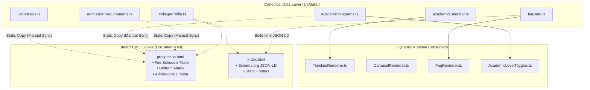

# Data Layer & Canonical Information Architecture

## 1. Overview

The SJCCC application stores its structured institutional facts in typed TypeScript files under `src/data/`. These files act as the **single source of truth (SSOT)** for official college data:

*Mermaid source: [docs/diagrams/data-flow.mmd](../diagrams/data-flow.mmd)*

---

## 2. Canonical Datasets Inventory

### 1. `tuitionFees.ts`
- **Purpose**: Official fee schedules approved for the 2026/2027 academic year.
- **Canonical Entities**: `TUITION_FEES` (First Cycle Day/Boarding, Second Cycle Day/Boarding, PTA levies, BEPHA health insurance coverage, and 3-term installment breakdowns).
- **Consumers**: Re-exported in `src/pages/prospectus/prospectus.ts`.
- **HTML Relationship**: **Static HTML Copy.** `prospectus.html` contains hardcoded `<table>` rows matching these figures to guarantee zero-JS readability.
- **Synchronization**: Any change to official fees must be updated in `tuitionFees.ts` and mirrored in `prospectus.html`.

### 2. `academicPrograms.ts`
- **Purpose**: Academic curricula across General Education (Arts & Science) and Technical Education.
- **Canonical Entities**: `ACADEMIC_PATHWAYS`, `TECHNICAL_DEPARTMENTS` (Building Construction, Woodwork, Metalwork, Electricity, Home Economics).
- **Consumers**: `AcademicLevelToggles.ts` (Homepage), re-exported by `prospectus.ts`.
- **HTML Relationship**: Rendered dynamically on homepage; hardcoded tabular copy in `prospectus.html`.

### 3. `admissionRequirements.ts`
- **Purpose**: Entrance prerequisites, required dossier documents, and interview protocols.
- **Canonical Entities**: `ADMISSION_REQUIREMENTS` (First Cycle Form 1 entrance vs Transfer students).
- **Consumers**: Re-exported in `src/pages/prospectus/prospectus.ts`.
- **HTML Relationship**: **Static HTML Copy** in `prospectus.html`.

### 4. `academicCalendar.ts`
- **Purpose**: Academic session milestones, term resumptions, feast days, and GCE examination windows.
- **Canonical Entities**: `ACADEMIC_MILESTONES_2026_2027`.
- **Consumers**: `TimelineRenderer.ts` (Homepage interactive timeline), re-exported in `prospectus.ts`.
- **HTML Relationship**: Dynamically rendered on homepage; static milestone table in `prospectus.html`.

### 5. `collegeProfile.ts`
- **Purpose**: Legal institutional metadata, founding history (est. 1963), Latin motto, and contact endpoints.
- **Canonical Entities**: `COLLEGE_PROFILE` (Principal Rev. Fr. Joseph Gael Kenne, Archdiocese of Bamenda, Mbengwi coordinates).
- **Consumers**: Used across both pages for metadata, footer text, and contact links.

### 6. `faqData.ts`
- **Purpose**: Frequently asked questions covering admissions, boarding life, technical workshops, and fees.
- **Canonical Entities**: `FAQ_ITEMS` (questions, answers, categories).
- **Consumers**: `FaqRenderer.ts` (Homepage dynamic accordion) and Schema.org `FAQPage` JSON-LD in `index.html`.

### 7. Supplementary Datasets
- `campusZones.ts`: 6 campus zones for the interactive SVG map (`VirtualCampusMap.ts`).
- `campusSlides.ts`: Carousel photography metadata and captions (`CarouselRenderer.ts`).
- `newsStories.ts`: Campus circulars and official GCE examination achievement reports.
- `pastAnnouncements.ts`: Archived bulletins displayed in `PastAnnouncementsModal.ts`.

---

## 3. Dynamic Hydration vs Static Duplication

| Data Module | Homepage Usage | Prospectus Usage | Synchronization Method |
| :--- | :--- | :--- | :--- |
| `tuitionFees.ts` | Summary figures | Complete tabular fee schedule | **Manual Parity Required** |
| `academicPrograms.ts` | Dynamic filter buttons | Static subject list | **Manual Parity Required** |
| `admissionRequirements.ts` | Summary text | Static requirements table | **Manual Parity Required** |
| `academicCalendar.ts` | Dynamic interactive timeline | Static calendar section | **Manual Parity Required** |
| `faqData.ts` | Dynamic accordion | Not included | Automated via Renderer |
| `campusSlides.ts` | Dynamic carousel | Not included | Automated via Renderer |

### Architectural Decision on HTML Duplication:
The Prospectus deliberately duplicates canonical data in static HTML rather than injecting it via client-side JavaScript. This preserves:
- Instant first contentful paint (FCP).
- Guaranteed search engine indexation of fee tables without requiring JavaScript execution.
- Flawless offline printing and PDF generation even on low-end mobile devices.

---

## 4. Cross-Links

- [System Overview](overview.md)
- [Prospectus Architecture](prospectus.md)
- [Homepage Architecture](homepage.md)
- [Architectural Decision Records](decisions.md)
