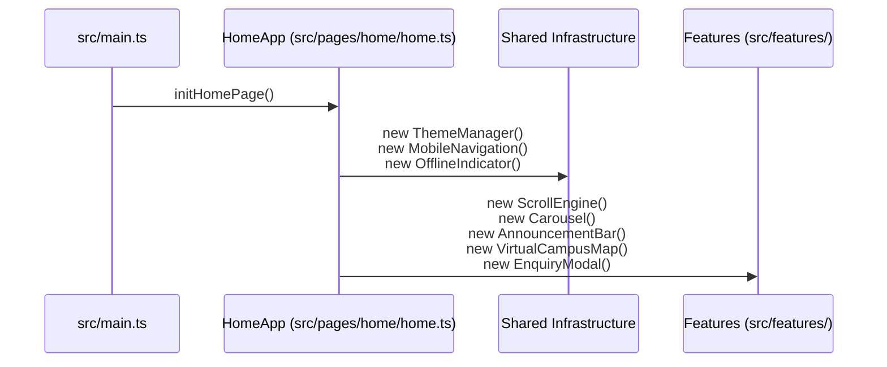

# Homepage Architecture

## 1. Overview

The Homepage (`/` or `/index.html`) is the interactive digital campus gateway for St. Joseph's Catholic Comprehensive College. It combines progressive enhancement, touch/scroll ergonomics, interactive data displays, and dynamic admission enquiries.

*Mermaid source: [docs/diagrams/homepage-flow.mmd](../diagrams/homepage-flow.mmd)*

---

## 2. Entrypoint & Composition Root

- **Entrypoint (`src/main.ts`)**:
  1. Injects `src/css/main.css` and `src/css/scrollEffect.css`.
  2. Invokes `initServiceWorker()` from `src/services/serviceWorker.ts`.
  3. Binds `DOMContentLoaded` listener to trigger `initHomePage()`.
- **Composition Root (`src/pages/home/home.ts` -> `HomeApp`)**:
  Acts as the centralized orchestrator. It instantiates all feature controllers, binds DOM elements using `HOME_SELECTORS`, and wires up event listeners.

---

## 3. Feature Breakdown Matrix

| Feature | TypeScript Controller | CSS Stylesheet | Canonical Data Source | Shared Infrastructure Consumed |
| :--- | :--- | :--- | :--- | :--- |
| **Hero & Scroll Engine** | `src/features/hero/ScrollEngine.ts` `src/features/hero/HeroParticles.ts` | `src/css/features/hero.css` `src/css/scrollEffect.css` | In-memory message list in `home.ts` | `src/ui/utils/TextSplitter.ts` |
| **Campus Carousel** | `src/features/carousel/Carousel.ts` `CarouselRenderer.ts` | `src/css/features/carousel.css` | `src/data/campusSlides.ts` | Native touch gestures |
| **Announcement Bar** | `src/features/announcement/AnnouncementBar.ts` `PastAnnouncementsModal.ts` | `src/css/features/announcement.css` | `src/data/pastAnnouncements.ts` | `src/core/storage/storageKeys.ts` |
| **Academic Pathways** | `src/features/academic/AcademicLevelToggles.ts` | `src/css/features/academics.css` | `src/data/academicPrograms.ts` | DOM class filtering |
| **Milestones Timeline** | `src/features/calendar/SchoolDatesTimeline.ts` `TimelineRenderer.ts` | `src/css/features/calendar-timeline.css` | `src/data/academicCalendar.ts` | `src/ui/utils/ScrollReveal.ts` |
| **Virtual Campus Map** | `src/features/campus/VirtualCampusMap.ts` | `src/css/features/campus-map.css` | `src/data/campusZones.ts` | Dynamic SVG layer binding |
| **Location Map Facade** | `src/features/location/LocationMapFacade.ts` | `src/css/features/map-embed.css` | Coordinates in HTML | Facade pattern for iframe lazy load |
| **News & GCE Results** | `src/features/news/NewsStoriesRenderer.ts` | `src/css/features/gce-results.css` | `src/data/newsStories.ts` | `src/ui/utils/ScrollReveal.ts` |
| **FAQ Accordion** | `src/features/faq/FaqSection.ts` `FaqRenderer.ts` | `src/css/features/faq.css` | `src/data/faqData.ts` | Schema.org JSON-LD in HTML |
| **Admissions Enquiry** | `src/features/enquiry/EnquiryModal.ts` `EnquiryForm.ts` `SmoothTypingEffect.ts` | `src/css/features/enquiry.css` `src/css/features/enquiry-typing.css` | Formspree / WhatsApp URL | `src/services/enquiryService.ts` |
| **PWA Install Prompt** | `src/features/pwa/PwaInstallPrompt.ts` | `src/css/components/dialog.css` | `public/manifest.json` | `src/ui/dialog/ConfirmDialog.ts` |
| **Preloader** | `src/features/preloader/Preloader.ts` | `src/css/features/preloader.css` | None | Session flag in memory |
| **Header Progressive Blur** | `src/ui/navigation/HeaderScroll.ts` | `src/css/layout/header.css` | None | Window scroll listener |
| **Section & Dock Active Tracking** | `src/ui/navigation/ScrollSpy.ts` | `src/css/layout/navigation.css` `src/css/layout/navigation-mobile.css` | `src/core/config/navigation.ts` | `IntersectionObserver`, `aria-current="location"` sync |

---

## 4. Key Architectural Patterns in Homepage

### 1. Canonical Navigation & Dock Ordering
Navigation hierarchy across Desktop, Mobile Drawer, and Mobile Bottom Dock is unified under `src/core/config/navigation.ts`. Dock items follow the canonical order: `Theme -> Home -> Academics -> Dates -> Results -> Map -> Menu`. `ScrollSpy.ts` continuously detects the visible section and synchronizes active states and `aria-current="location"` across all navigation surfaces.

### 2. Facade Pattern for External Integrations
The Google Map embed in `src/features/location/LocationMapFacade.ts` defers iframe creation until user interaction, preventing heavy third-party scripts from impacting first input delay (FID) or Lighthouse performance scores.

### 3. Live Dynamic Renderers with Fallback
Components like the Carousel, FAQ, and School Dates utilize dedicated renderers (`CarouselRenderer.ts`, `FaqRenderer.ts`, `TimelineRenderer.ts`) that populate DOM containers directly from canonical datasets in `src/data/`.

### 4. Image Fallback Safety Guards
`HomeApp.prototype.initImageFallbackGuards()` sets a window-level capture-phase error listener for `` tags. Any broken image URL automatically redirects to `/assets/Error-Image.jpeg` or `/assets/icons/icon.svg` without unhandled console errors.

---

## 5. Cross-Links

- [System Overview](overview.md)
- [Shared Infrastructure](shared-infrastructure.md)
- [Prospectus Architecture](prospectus.md)
- [Canonical Data Layer](data-layer.md)
- [CSS Architecture](css-architecture.md)
