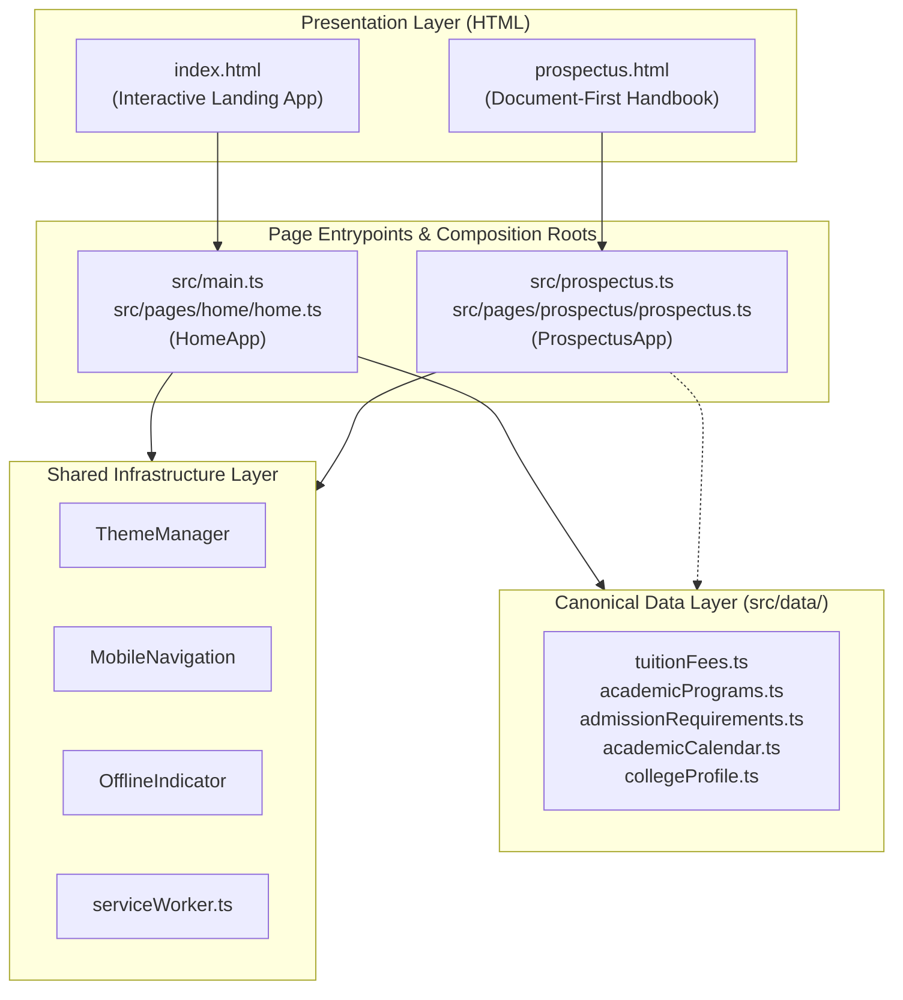

# SJCCC Architecture — System Overview

## 1. Executive Summary

St. Joseph's Catholic Comprehensive College (SJCCC), Mbengwi, operates a **dual-entrypoint, progressive web application (PWA)** built using modern TypeScript, multi-page HTML, and modular CSS.

The application serves two distinct user personas with two distinct technical approaches:
1. **Interactive Digital Campus (`/` or `/index.html`)**: Rich interactive web application showcasing academic pathways, campus life, dynamic announcements, procedural hero physics, touch carousels, admissions enquiry modal, and interactive 6-zone campus tour.
2. **Document-First Student Handbook (`/prospectus.html`)**: High-density institutional reference document formatted for screen reading, offline study, and native A4 PDF generation. Built with a strict **document-first** philosophy where all content remains 100% visible and readable with JavaScript disabled.

Both entrypoints share a single underlying core infrastructure, canonical data layer, and Service Worker caching engine.

---

## 2. High-Level Architecture Diagram

*Mermaid source: [docs/diagrams/application-architecture.mmd](../diagrams/application-architecture.mmd)*

---

## 3. Architectural Tiers

The codebase is organized into clean, low-coupling architectural tiers:

| Tier | Directory | Primary Role |
| :--- | :--- | :--- |
| **Presentation** | Root (`index.html`, `prospectus.html`) | Semantic HTML entrypoints with structured microdata (Schema.org) and accessible landmarks. |
| **Entrypoints** | `src/main.ts`, `src/prospectus.ts` | Bootstrap scripts that register the Service Worker and trigger composition roots on `DOMContentLoaded`. |
| **Composition Roots** | `src/pages/home/home.ts`, `src/pages/prospectus/prospectus.ts` | Page orchestrators responsible for instantiating features and passing configuration down to UI controllers. |
| **Shared Infrastructure** | `src/core/`, `src/ui/navigation/`, `src/features/offline/` | Page-agnostic modules (`ThemeManager`, `MobileNavigation`, `OfflineIndicator`, storage keys, selectors). |
| **Domain Features** | `src/features/` | Self-contained feature modules (Hero physics, Announcement bar, Campus map, Enquiry modal, FAQ). |
| **Canonical Data Layer** | `src/data/` | Typed institutional datasets serving as the single source of truth for fees, curriculum, and admissions. |
| **Offline & PWA** | `src/sw.ts`, `src/sw-register.ts`, `src/services/` | Two-phase service worker build precaching HTML, hashed assets, and handling offline routing. |
| **Design System / CSS** | `src/css/` | Shared core tokens and typography scales, homepage feature stylesheets, and an isolated 10-module prospectus suite. |

---

## 4. Key Architectural Invariants

1. **Document-First Prospectus**: The Prospectus must never require JavaScript to display its content, tables, or institutional rules. CSS default states must remain `opacity: 1; transform: none;`.
2. **Shared Infrastructure Reuse**: Cross-page behaviors (theming, drawer navigation, offline notifications) must reuse existing shared modules rather than duplicating logic.
3. **Multi-Page Application (MPA) Independence**: Direct entry to `/prospectus.html` works autonomously without requiring prior visits to `/index.html`.
4. **Offline First**: All primary HTML pages, fonts, stylesheets, and core imagery are cached during Service Worker installation.

---

## 5. Next Steps & Detailed Navigation

- [Shared Infrastructure Architecture](shared-infrastructure.md)
- [Homepage Architecture](homepage.md)
- [Prospectus Architecture](prospectus.md)
- [Canonical Data Layer](data-layer.md)
- [CSS Architecture](css-architecture.md)
- [TypeScript Architecture](typescript-architecture.md)
- [Navigation Architecture](navigation.md)
- [PWA & Offline Architecture](pwa.md)
- [Accessibility Architecture](accessibility.md)
- [Build & Deployment Pipeline](build-and-deployment.md)
- [Architectural Decision Records](decisions.md)
