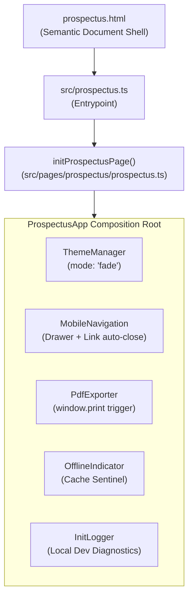

# Prospectus Architecture

## 1. Overview & Philosophy

The SJCCC Official Prospectus (`/prospectus.html`) serves as the college's legal, statutory, and academic student handbook. 

Unlike the Homepage, the Prospectus is built under a strict **Document-First Architecture**:
1. **Zero-JS Baseline**: All institutional copy, rules, uniforms, and approved fee schedules are rendered directly in static semantic HTML. If JavaScript is disabled, blocked, or fails to execute, the complete document remains 100% visible, accessible, and readable.
2. **Native A4 Print Engine**: A dedicated print stylesheet (`src/css/prospectus/print.css`) handles `@page` setup, suppresses web navigation chrome, neutralizes dark mode backgrounds to save printer toner, and formats section cards into paired 2-column grids for clean A4 printing.
3. **Progressive Enhancement**: When JavaScript is active, it layers on smooth theme toggling (`mode: 'fade'`), responsive mobile drawer navigation, live PWA offline status monitoring, and a floating PDF export trigger.



*Mermaid source: [docs/diagrams/prospectus-flow.mmd](../diagrams/prospectus-flow.mmd)*

---

## 2. Controller Hierarchy

The TypeScript orchestrator in `src/pages/prospectus/prospectus.ts` is intentionally lean (94 lines). It does not maintain heavy client-side state or perform DOM manipulation of handbook prose:

```typescript
export class ProspectusApp {
    constructor() {
        this.init();
    }

    private init(): void {
        // 1. Shared Theme Manager in lightweight fade mode
        new ThemeManager({
            toggleId: PROSPECTUS_SELECTORS.darkModeToggle,
            mode: 'fade',
        });

        // 2. Shared Mobile Navigation for small screens
        new MobileNavigation(
            PROSPECTUS_SELECTORS.menuToggle,
            PROSPECTUS_SELECTORS.navMenu,
            PROSPECTUS_SELECTORS.mainHeader,
            PROSPECTUS_SELECTORS.navLink
        );

        // 3. Local Native PDF / Print Export Handler
        new PdfExporter(PROSPECTUS_SELECTORS.downloadPdfBtn);

        // 4. Shared Offline Connectivity Status Indicator
        new OfflineIndicator();

        // 5. Development Diagnostics Logger
        new InitLogger();
    }
}
```

---

## 3. Shared Infrastructure Consumed

| Shared Module | Origin | Usage in Prospectus |
| :--- | :--- | :--- |
| `ThemeManager` | `src/core/theme/ThemeManager.ts` | Configured with `mode: 'fade'`. Instead of the heavy radial SVG clip-path used on the homepage, it triggers a gold-tinted opacity cross-fade for document reading. |
| `MobileNavigation` | `src/ui/navigation/MobileNavigation.ts` | Manages the sticky header hamburger button and navigation drawer. Configured with `PROSPECTUS_SELECTORS.navLink` to automatically close the drawer upon clicking in-page section anchors. |
| `OfflineIndicator` | `src/features/offline/OfflineIndicator.ts` | Monitors network status and verifies if `/prospectus.html` is cached in Cache Storage. |
| `serviceWorker` | `src/services/serviceWorker.ts` | Registered at entrypoint (`src/prospectus.ts`) to ensure direct visitors have immediate PWA caching. |
| `offline-indicator.css` | `src/css/components/offline-indicator.css` | Reused directly via `@import` in `src/css/prospectus.css`. |

---

## 4. Local Helpers

- **`PdfExporter`**:
  Simple, unopinionated class that attaches a click listener to `#downloadPdfBtn`. It invokes the browser's native `window.print()` method. All layout transformations, background adjustments, and element suppression are delegated entirely to CSS (`@media print`), eliminating DOM mutations.
- **`InitLogger`**:
  Diagnostic utility that logs a styled welcome banner in browser developer tools only when running under `localhost` or `127.0.0.1`.

---

## 5. Print & PDF Architecture

The print engine is governed by `src/css/prospectus/print.css`.

Key characteristics:
1. **Standardized Page Size**: `@page { size: A4 portrait; margin: 5mm !important; }`.
2. **Interactive Chrome Suppression**: `#mainHeader`, `#navMenu`, `.menu-toggle`, `.download-action-container`, and offline banners receive `display: none !important;`.
3. **Paired 2-Column Grid Layout**: On paper, the 12-column grid switches to `display: flex !important; flex-wrap: wrap !important; gap: 2mm !important;`, with cards taking `calc(50% - 1mm)` width. This maximizes page economy and prevents excessive paper usage.
4. **Dark Mode Neutralization**: Forces `background: #ffffff !important` and `color: #1a1e2b !important` even if the user had dark mode active, ensuring clean, toner-saving printouts.
5. **Page Break Safeguards**: `break-inside: avoid; page-break-inside: avoid;` on section cards and table rows prevents mid-card splits.

---

## 6. Cross-Links

- [System Overview](overview.md)
- [Shared Infrastructure](shared-infrastructure.md)
- [CSS Architecture](css-architecture.md)
- [Canonical Data Layer](data-layer.md)
- [PWA & Offline Architecture](pwa.md)
