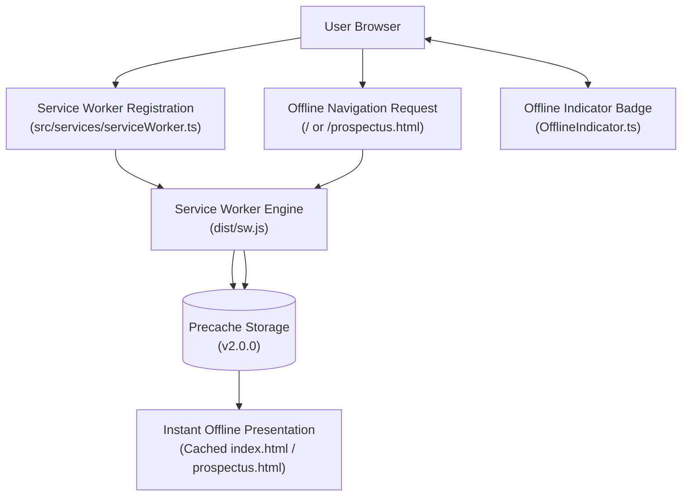
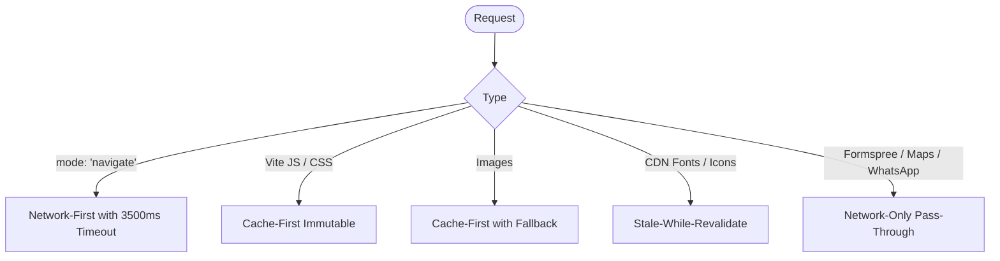

# PWA & Offline Subsystem Architecture

## 1. Overview

SJCCC implements a production-grade Progressive Web App (PWA) architecture. The application is completely functional without an internet connection once visited, providing offline access to admissions information, student guidelines, and tuition fee schedules.

*Mermaid source: [docs/diagrams/pwa-flow.mmd](../diagrams/pwa-flow.mmd)*

---

## 2. Service Worker Lifecycle (`src/sw.ts`)

The Service Worker (`dist/sw.js`, compiled from `src/sw.ts`) manages caching policies, lifecycle events, and network failures.

### Caching Namespaces (`CACHE_VERSION = 'v2.0.0'`)
1. **`sjccc-precache-v2.0.0`**: Mandatory application shell, HTML documents, hashed CSS/JS, and offline fallback graphics.
2. **`sjccc-runtime-v2.0.0`**: Dynamic runtime assets (Google Fonts, cdnjs icons). Bounded to **50 entries** with FIFO eviction.
3. **`sjccc-images-v2.0.0`**: Campus photography and SVG icons. Bounded to **60 entries** with FIFO eviction.
4. **`sjccc-offline-v2.0.0`**: Standalone emergency offline documents.

### Request Routing Strategies

*Mermaid source: [docs/diagrams/service-worker-flow.mmd](../diagrams/service-worker-flow.mmd)*

1. **HTML Navigation (`mode === 'navigate'`)**:
   - **Network-First with 3.5s Timeout**: Attempts to fetch the latest HTML from the network for 3,500ms. If the network is slow or offline, it immediately serves the precached `index.html` or `prospectus.html`.
   - **Offline Fallback**: If an uncached HTML route is requested while offline, it returns the inline `OFFLINE_HTML` fallback page.
2. **Hashed Production Assets (JS, CSS)**:
   - **Cache-First**: Hashed filenames (e.g. `main-DtFRR8oB.js`) are immutable. The Service Worker returns them directly from cache, avoiding network roundtrips.
3. **Images (`.jpg`, `.png`, `.webp`, `.svg`)**:
   - **Cache-First with Fallback**: Serves from cache; fetches from network if absent. If the network fails, returns `/assets/Error-Image.jpeg`.
4. **Approved CDNs (`fonts.googleapis.com`, `cdnjs.cloudflare.com`)**:
   - **Stale-While-Revalidate**: Serves cached version immediately while updating in the background.
5. **Sensitive APIs (Network-Only)**:
   - External services (`formspree.io`, WhatsApp URLs, Google Maps, `/api/*`) are **never cached** to ensure live messaging and security.

---

## 3. What Happens When Opening the Prospectus Offline

1. The user navigates to `/prospectus.html` with Wi-Fi/cellular disabled.
2. The browser delegates the request to the active Service Worker.
3. The Service Worker detects `mode === 'navigate'` and attempts network connection.
4. The network fails or exceeds 3,500ms.
5. The Service Worker retrieves `/prospectus.html` from `sjccc-precache-v2.0.0`.
6. The HTML document renders instantly from cache.
7. `src/prospectus.ts` executes and instantiates `OfflineIndicator`.
8. `OfflineIndicator` checks `navigator.onLine === false`, confirms `/prospectus.html` is cached, and displays:  
   *"Working Offline — Viewing Cached Prospectus Handbook"*.
9. All 9 sections, fee tables, and uniform matrices remain completely readable.
10. The user can click *"Download PDF"* to invoke `window.print()` and save an A4 copy even while offline.

---

## 4. Web App Manifest & Installation

- **Manifest (`public/manifest.json`)**:
  - `name`: "St. Joseph's Catholic Comprehensive College — Mbengwi"
  - `short_name`: "SJCCC Mbengwi"
  - `display`: "standalone"
  - `theme_color`: "#07182E"
  - `background_color`: "#020C1A"
  - `icons`: Maskable PNGs and SVG vectors from 72x72 to 512x512.
- **In-App Install Prompt (`PwaInstallPrompt.ts`)**:
  - Intercepts `window.addEventListener('beforeinstallprompt')`.
  - Prompts eligible mobile/desktop users after initial page engagement.
  - Honors a 7-day dismissal window stored in `localStorage`.

---

## 5. Cross-Links

- [System Overview](overview.md)
- [Shared Infrastructure](shared-infrastructure.md)
- [Prospectus Architecture](prospectus.md)
- [Build & Deployment Pipeline](build-and-deployment.md)
