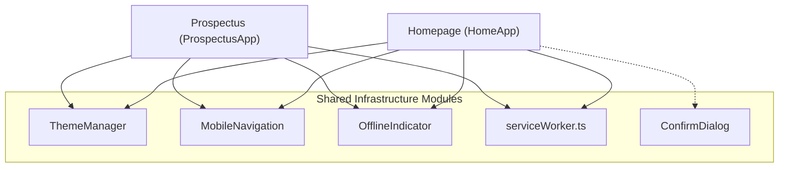

# Shared Infrastructure Architecture

## 1. Overview

The SJCCC codebase maintains a clean distinction between page-agnostic shared infrastructure and page-specific controllers. Shared infrastructure modules reside in `src/core/`, `src/ui/`, and `src/features/offline/`.

*Mermaid source: [docs/diagrams/shared-infrastructure.mmd](../diagrams/shared-infrastructure.mmd)*

---

## 2. Shared Modules Specification

### ThemeManager

| Attribute                  | Details                                                                                                                                                                                                                                                               |
|:---------------------------|:----------------------------------------------------------------------------------------------------------------------------------------------------------------------------------------------------------------------------------------------------------------------|
| **Location**               | `src/core/theme/ThemeManager.ts`                                                                                                                                                                                                                                      |
| **Primary Responsibility** | Manages application theme (Light vs Dark mode), persistent `localStorage` synchronization, system `prefers-color-scheme` listeners, and synchronized ARIA states across all theme toggle buttons.                                                                     |
| **Page Agnostic?**         | **Yes.** Configurable for both pages.                                                                                                                                                                                                                                 |
| **Public API**             | • `constructor(options?: ThemeManagerOptions \| string)` • `getCurrentTheme(): ThemeMode` • `setTheme(theme: ThemeMode): void` • `toggleTheme(): void` • `destroy(): void`                                                                                |
| **Consumers**              | • Homepage (`HomeApp` via `new ThemeManager(HOME_SELECTORS.themeToggle)`) • Prospectus (`ProspectusApp` via `new ThemeManager({ toggleId: PROSPECTUS_SELECTORS.darkModeToggle, mode: 'fade' })`)                                                                   |
| **Dependencies**           | `src/core/theme/themeTypes.ts`, `src/core/storage/storageKeys.ts` (`STORAGE_KEYS.THEME_PREFERENCE`)                                                                                                                                                                   |
| **Lifecycle & State**      | 1. Checks `localStorage.getItem('sjccc_theme')`. 2. Falls back to `window.matchMedia('(prefers-color-scheme: dark)')`. 3. Adds/removes `dark-mode` CSS class on `document.documentElement` and `document.body`. 4. Updates `aria-checked` on toggle buttons. |
| **Events / Observers**     | Listens to `click` on toggle buttons, `keydown` (`Enter`/`Space`), and `change` on `prefers-color-scheme` media query list.                                                                                                                                           |

#### Operational Modes:
- **`animated` (Default, Homepage)**: Injects an overlay element with dynamic SVG clip-paths transitioning radially across the screen.
- **`fade` (Prospectus)**: Injects a lightweight overlay element (`.theme-transition-overlay`) with a subtle 300ms gold glow opacity fade, ideal for high-density document reading.

---

### MobileNavigation

| Attribute                  | Details                                                                                                                                                                                                                                    |
|:---------------------------|:-------------------------------------------------------------------------------------------------------------------------------------------------------------------------------------------------------------------------------------------|
| **Location**               | `src/ui/navigation/MobileNavigation.ts`                                                                                                                                                                                                    |
| **Primary Responsibility** | Manages responsive mobile navigation drawer, hamburger button state, backdrop dismissal, `Escape` key trapping, and link-click auto-close.                                                                                                 |
| **Page Agnostic?**         | **Yes.** Parameterized via selector IDs.                                                                                                                                                                                                   |
| **Public API**             | • `constructor(menuToggleId: string, navMenuId: string, headerId: string, linkSelector?: string)` • `toggle(): void` • `open(): void` • `close(): void` • `isOpen(): boolean` • `destroy(): void`                           |
| **Consumers**              | • Homepage (`HomeApp`) • Prospectus (`ProspectusApp`)                                                                                                                                                                                   |
| **Dependencies**           | Native DOM APIs only. No external library dependencies.                                                                                                                                                                                    |
| **Lifecycle & State**      | Toggles `active` class on navigation menu, updates `aria-expanded` on menu toggle button, sets `aria-hidden` on drawer.                                                                                                                    |
| **Events / Observers**     | • `click` on hamburger button. • `click` outside menu container (backdrop click). • `keydown` event on `window` listening for `Escape`. • `click` on child navigation links (automatically closes drawer after anchor selection). |

---

### OfflineIndicator

| Attribute                  | Details                                                                                                                                                                                                                                                              |
|:---------------------------|:---------------------------------------------------------------------------------------------------------------------------------------------------------------------------------------------------------------------------------------------------------------------|
| **Location**               | `src/features/offline/OfflineIndicator.ts`                                                                                                                                                                                                                           |
| **Primary Responsibility** | Real-time monitoring of browser connectivity and Service Worker cache readiness. Displays a non-intrusive floating status badge with accessible announcements.                                                                                                       |
| **Page Agnostic?**         | **Yes.** Self-mounting DOM element.                                                                                                                                                                                                                                  |
| **Public API**             | • `constructor(options?: OfflineIndicatorOptions)` • `showOfflineBadge(): void` • `showOnlineBadge(): void` • `hide(): void` • `destroy(): void`                                                                                                         |
| **Consumers**              | • Homepage (`HomeApp`) • Prospectus (`ProspectusApp`)                                                                                                                                                                                                             |
| **Dependencies**           | `src/css/components/offline-indicator.css`                                                                                                                                                                                                                           |
| **Lifecycle & State**      | 1. Injects `#offlineIndicator` container into `document.body` if not present. 2. Verifies `navigator.onLine`. 3. Inspects Service Worker registration to verify if the active page is cached. 4. Displays "Working Offline — Viewing Cached Handbook/Site". |
| **Events / Observers**     | • `window.addEventListener('online')` • `window.addEventListener('offline')`                                                                                                                                                                                      |

---

### Service Worker Bootstrap Service

| Attribute                  | Details                                                                                                          |
|:---------------------------|:-----------------------------------------------------------------------------------------------------------------|
| **Location**               | `src/services/serviceWorker.ts`                                                                                  |
| **Primary Responsibility** | Bootstraps Service Worker registration, coordinates update detection, and provides reload messaging.             |
| **Page Agnostic?**         | **Yes.**                                                                                                         |
| **Public API**             | • `initServiceWorker(): Promise<ServiceWorkerRegistration \| undefined>` • `checkForUpdates(): Promise<void>` |
| **Consumers**              | `src/main.ts`, `src/prospectus.ts`                                                                               |
| **Dependencies**           | `src/sw-register.ts`                                                                                             |

---

### ConfirmDialog

| Attribute                  | Details                                                                                            |
|:---------------------------|:---------------------------------------------------------------------------------------------------|
| **Location**               | `src/ui/dialog/ConfirmDialog.ts`                                                                   |
| **Primary Responsibility** | Reusable glassmorphic accessible confirmation dialog with focus trap and spring animation physics. |
| **Page Agnostic?**         | **Yes.**                                                                                           |
| **Public API**             | • `ConfirmDialog.show(options: ConfirmDialogOptions): Promise<boolean>`                            |
| **Consumers**              | `src/features/pwa/PwaInstallPrompt.ts` (Homepage)                                                  |
| **Dependencies**           | `src/css/components/dialog.css`, `src/core/physics/spring.ts`                                      |

---

## 3. Configuration & Constants Primitives

1. **`src/core/config/selectors.ts`**:
   - `HOME_SELECTORS`: Centralized DOM element IDs and CSS selectors for the landing page.
   - `PROSPECTUS_SELECTORS`: Centralized DOM element IDs and CSS selectors for the document page.
2. **`src/core/storage/storageKeys.ts`**:
   - `STORAGE_KEYS`: Namespaced keys for `localStorage` (`sjccc_theme`, `announcement_dismissed_until`, `pwa_prompt_dismissed`).

---

## 4. Cross-Links

- [System Overview](overview.md)
- [Homepage Architecture](homepage.md)
- [Prospectus Architecture](prospectus.md)
- [PWA & Offline Subsystem](pwa.md)
