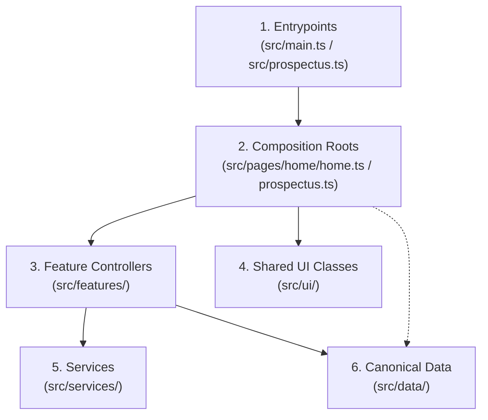

# TypeScript Architecture & Code Organization

## 1. Overview & Taxonomy

The SJCCC TypeScript codebase strictly differentiates between architectural roles to avoid monolithic "god classes" and unnecessary abstraction layers.

```text
Layer                  Role                                    Example File
------------------------------------------------------------------------------------------------------
Entrypoint             Bootstrap script binding to DOM event    src/main.ts, src/prospectus.ts
Composition Root       Page orchestrator instantiating modules  src/pages/home/home.ts, prospectus.ts
Feature Module         Self-contained business domain unit      src/features/hero/ScrollEngine.ts
Shared UI Class        Page-agnostic UI primitive               src/ui/navigation/MobileNavigation.ts
Client Service         Network or platform API abstraction      src/services/serviceWorker.ts
Utility                Pure helper functions / math / springs   src/core/physics/spring.ts
Data Module            Typed canonical datasets                 src/data/tuitionFees.ts
```



*Mermaid source: [docs/diagrams/module-dependencies.mmd](../diagrams/module-dependencies.mmd)*

---

## 2. Initialization Lifecycle

Both pages follow an identical initialization contract that handles varied script injection timing:

```typescript
// 1. Initialize Service Worker precaching & lifecycle immediately
initServiceWorker();

// 2. Defer page composition root until DOM is ready
if (document.readyState === 'loading') {
    document.addEventListener('DOMContentLoaded', () => {
        initPage();
    });
} else {
    initPage();
}
```

This guarantees that:
- Network workers start registration immediately.
- DOM elements exist before query selectors execute.
- Pages loaded via browser cache or bfcache (back-forward cache) execute predictably.

---

## 3. Structural Layers

### 1. Entrypoints (`src/main.ts`, `src/prospectus.ts`)
- Minimalist scripts (< 30 lines) acting as the bridge between Vite bundle entrypoints and application code.
- Never contain inline UI logic or complex state.

### 2. Composition Roots (`src/pages/`)
- **`HomeApp` (`src/pages/home/home.ts`)**: Orchestrates 19 sub-features (Preloader, ThemeManager, AnnouncementBar, Carousel, Timelines, Map, Enquiry, PWA Prompt).
- **`ProspectusApp` (`src/pages/prospectus/prospectus.ts`)**: Lean orchestrator (94 lines) binding `ThemeManager`, `MobileNavigation`, `PdfExporter`, and `OfflineIndicator`.

### 3. Feature Modules (`src/features/`)
Self-contained functional units encapsulating their own DOM event listeners, state, and child rendering:
- `academic/`: Curriculum tabs and levels.
- `announcement/`: Bulletin banner and modal archive.
- `calendar/`: Milestone timeline.
- `campus/`: Interactive SVG campus map.
- `carousel/`: Touch-enabled image slider.
- `enquiry/`: Admissions modal and form submission.
- `faq/`: Collapsible accordion.
- `hero/`: Multi-layer particle canvas and kinetic scroll engine.
- `location/`: Google Map embed facade.
- `news/`: News & GCE results renderer.
- `offline/`: PWA connectivity toast.
- `preloader/`: Initial loading screen.
- `pwa/`: BeforeInstallPrompt banner.

### 4. Shared UI Classes (`src/ui/`)
Generic primitives with no hardcoded domain logic:
- `navigation/HeaderScroll.ts`: Dynamic backdrop-blur header.
- `navigation/MobileNavigation.ts`: Accessible off-canvas drawer.
- `navigation/ScrollSpy.ts`: IntersectionObserver-based nav tracking.
- `dialog/ConfirmDialog.ts`: Glassmorphic modal dialog.
- `effects/LiquidGlassAdapter.ts`: Coordinates physical glass rendering via external `@kennejunior/liquidglass`.
- `utils/CardSplitter.ts`: Visual feedback boundary controller for adjacent cards and pathways.

### 5. Services (`src/services/`)
External API and browser platform adapters:
- `enquiryService.ts`: Dispatches admissions inquiries to Formspree or formats WhatsApp messages.
- `serviceWorker.ts`: Wraps `navigator.serviceWorker` registration.

### 6. Core Primitives (`src/core/`)
- `config/selectors.ts`: Strongly typed DOM selectors preventing magic string drift.
- `storage/storageKeys.ts`: Namespaced `localStorage` keys.
- `physics/spring.ts`: Physics calculations for liquid animations.

---

## 4. TypeScript Configuration

The project compiles with TypeScript 5.x under strict mode:
- `tsconfig.json`:
  - `"target": "ES2022"`
  - `"module": "ESNext"`
  - `"moduleResolution": "Bundler"`
  - `"allowImportingTsExtensions": true`
  - `"strict": true`
  - `"noEmit": true` (Transpilation is handled by Vite Rollup pipeline)

---

## 5. Cross-Links

- [System Overview](overview.md)
- [Shared Infrastructure](shared-infrastructure.md)
- [Homepage Architecture](homepage.md)
- [Prospectus Architecture](prospectus.md)
- [Build & Deployment](build-and-deployment.md)
