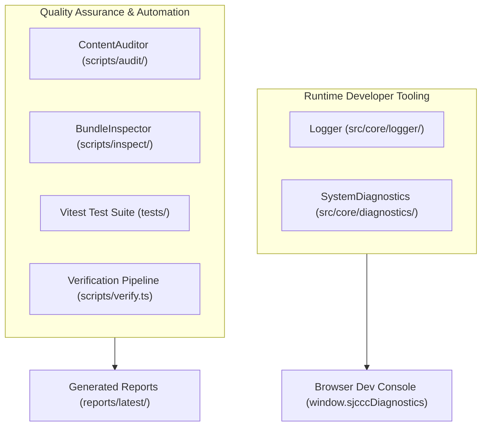
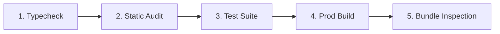

# SJCCC Developer Tooling & QA Automation Infrastructure

## 1. Overview

The SJCCC platform is supported by a dedicated developer tooling and automation architecture designed to streamline development, local debugging, static content verification, test automation, and production build diagnosis.

*Mermaid diagram source: [docs/diagrams/developer-tooling.mmd](../diagrams/developer-tooling.mmd)*

---

## 2. Command Reference

| Command | Action | Primary Output |
| :--- | :--- | :--- |
| `npm run dev` | Launches local development server on port 3000 | Live reload preview |
| `npm run lint` | Runs TypeScript static analysis (`tsc --noEmit`) | Compiler diagnostics |
| `npm run typecheck` | Alias for `npm run lint` | Type verification |
| `npm run test` | Runs unit, integration, and audit tests via Vitest | Test summary table |
| `npm run test:ci` | Runs tests and generates a standard JUnit XML report | `reports/junit.xml` |
| `npm run audit` | Performs static HTML metadata, anchor, link, and A11y audit | `reports/latest/*-audit.json` |
| `npm run inspect` | Inspects compiled `dist/` bundle sizes, gzip, and manifest | `reports/latest/bundle-inspection.json` |
| `npm run build` | Compiles application and Service Worker precache | `dist/` artifacts |
| `npm run verify` | Complete 5-stage automated verification pipeline | Full gatekeeper validation |

---

## 3. Tooling Subsystems

- [**Console & Logging Infrastructure**](console-and-logging.md): Enterprise structured logging with levels, namespaces, and production silencing.
- [**System Diagnostics**](diagnostics.md): In-browser developer diagnostic inspector (`window.sjcccDiagnostics()`).
- [**Auditing & Scraping Engine**](auditing-and-scraping.md): Static HTML parser, broken anchor resolver, Cameroon link formatter, and statutory card validator.
- [**Test Infrastructure**](testing.md): Native TypeScript test suite covering data integrity, logger behaviour, and DOM structure.
- [**XML Configuration & JUnit Schema**](xml-config.md): Policy on XML usage and the standard JUnit XML test output schema.
- [**Robot Framework Evaluation**](robot-framework.md): Architectural decision record explaining why Robot Framework was evaluated and rejected.

---

## 4. Verification Pipeline Workflow

Running `npm run verify` orchestrates the complete QA gatekeeper workflow:

*Mermaid diagram source: [docs/diagrams/qa-pipeline.mmd](../diagrams/qa-pipeline.mmd)*
