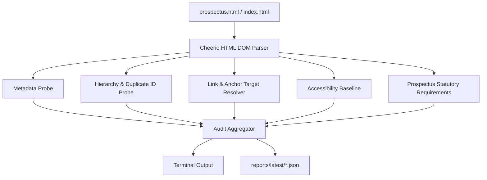

# Static Content Auditing & Scraping Engine

## 1. Overview & Purpose

The SJCCC Static Auditor (`scripts/audit/auditor.ts`) is a high-speed, headless static analysis engine that inspects the repository's HTML entrypoints (`index.html` and `prospectus.html`) for semantic correctness, link integrity, metadata compliance, accessibility baselines, and statutory document completeness.



*Mermaid diagram source: [docs/diagrams/prospectus-audit-flow.mmd](../diagrams/prospectus-audit-flow.mmd)*

---

## 2. Running the Audit

```bash
npm run audit
```

This command parses all known pages, outputs a colorized summary to the terminal, generates machine-readable JSON reports, and exits with status code `0` on success or `1` on error.

---

## 3. Audited Checks & Quality Rules

### 1. Document Metadata
- **`<title>` Tag**: Verifies presence, non-emptiness, and optimal length.
- **`<meta name="description">`**: Checks presence and descriptive character volume.
- **`<link rel="canonical">`**: Verifies canonical URL format.
- **OpenGraph & Twitter Cards**: Validates `og:title`, `og:description`, `og:image`, `og:url`, and `twitter:card`.

### 2. Heading Hierarchy & Duplicate IDs
- **Single `<h1>` Constraint**: Enforces exactly one main heading per document.
- **Duplicate ID Detection**: Traverses all elements with `id="..."` and flags duplicate identifiers that would cause invalid DOM queries or broken anchor targets.

### 3. Links & Anchor Resolution
- **Internal `#hash` Anchors**: Resolves every internal anchor against the document's element IDs. Any link pointing to a nonexistent ID is flagged as a fatal broken anchor.
- **Cameroon Phone Number Formatting**: Verifies that `tel:` links follow the official Cameroon international prefix (`tel:+237...`).
- **WhatsApp Links**: Checks that WhatsApp click-to-chat links contain the Cameroon country code (`237`).
- **Email Links**: Validates `mailto:` address syntax.

### 4. Media & Asset Discovery
- **`` Alt Text**: Ensures all images include an accessible `alt` attribute.
- **Disk Existence Verification**: Checks that local image paths referenced in HTML (e.g. `public/assets/Campus.jpeg`) physically exist on disk, preventing broken imagery.

### 5. Accessibility Baselines
- **Nameless Interactive Elements**: Verifies that buttons without visible text provide an `aria-label` or `title`.
- **Form Controls**: Checks that inputs and textareas are associated with `<label>` or `aria-label` attributes.

### 6. Prospectus Statutory Requirements
- **Mandatory Cards**: Verifies that all 9 official prospectus section cards exist in the DOM:
  1. `#about-sjccc`
  2. `#departments-entry`
  3. `#books-stationery`
  4. `#uniform-apparel`
  5. `#boarding-toiletry`
  6. `#school-rules`
  7. `#fees-structure`
  8. `#health-finance`
  9. `#important-dates`
- **Banking Payment Credentials**: Verifies the presence of the OPSEC Microfinance institutional account number (`100117`).

---

## 4. Machine-Readable JSON Output

When executed, the audit writes machine-readable reports to `reports/latest/`:

- `reports/latest/audit-summary.json`: Top-level summary across all pages with error/warning totals.
- `reports/latest/homepage-audit.json`: Detailed breakdown for `index.html`.
- `reports/latest/prospectus-audit.json`: Detailed breakdown for `prospectus.html`.
